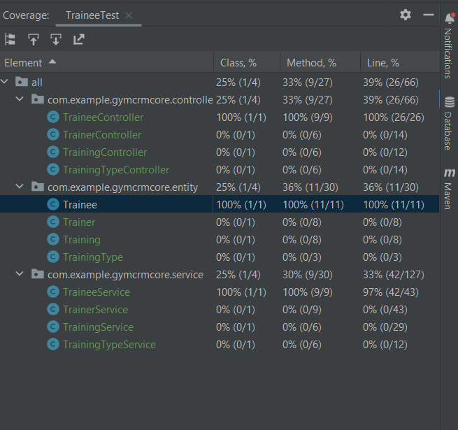

# Gym CRM System

## Overview

This project is a Spring-based module designed to handle a Gym CRM (Customer Relationship Management) system. The system includes functionality for managing trainee profiles, trainer profiles, and training sessions.

## Database Schema

The database schema for the Gym CRM system is designed to accommodate the following structure:

Please refer to the attached schema image for a visual representation of the database structure.

## Modules

### Trainee Service

The Trainee Service class provides functionality to manage trainee profiles. This includes the ability to create, update, delete, and select trainee profiles.

### Trainer Service
The Trainer Service class is responsible for managing trainer profiles. It offers functionality to create, update, and select trainer profiles.

### Training Service
The Training Service class supports the creation and selection of training profiles. It facilitates the management of training sessions within the Gym CRM system.

## Getting Started

To integrate this module into your project, follow these steps:

1. Clone the repository: `git clone https://github.com/aigulsharip/GymCRM.git`
2. Import the project into your preferred IDE.
3. Configure the database connection in the `application.properties` file.
4. Build and run the application.

## Dependencies

- [Spring Boot](https://spring.io/projects/spring-boot)
- [Spring Data JPA](https://spring.io/projects/spring-data-jpa)
- [H2 Database](https://www.h2database.com/html/main.html) (for development/testing)
- Add any additional dependencies...
